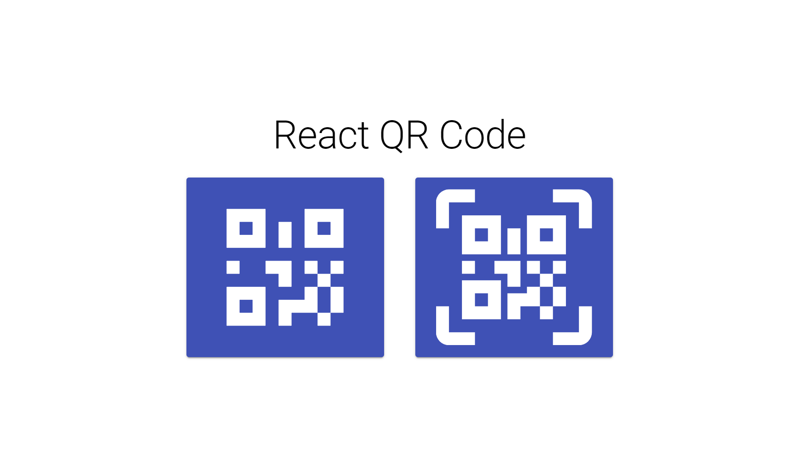
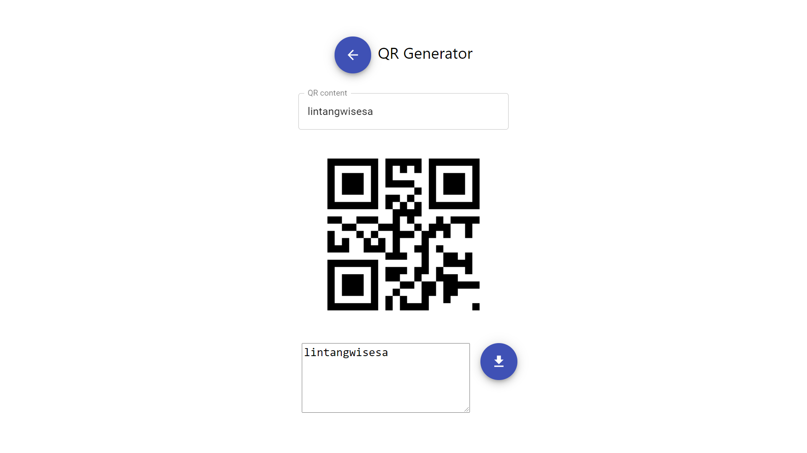
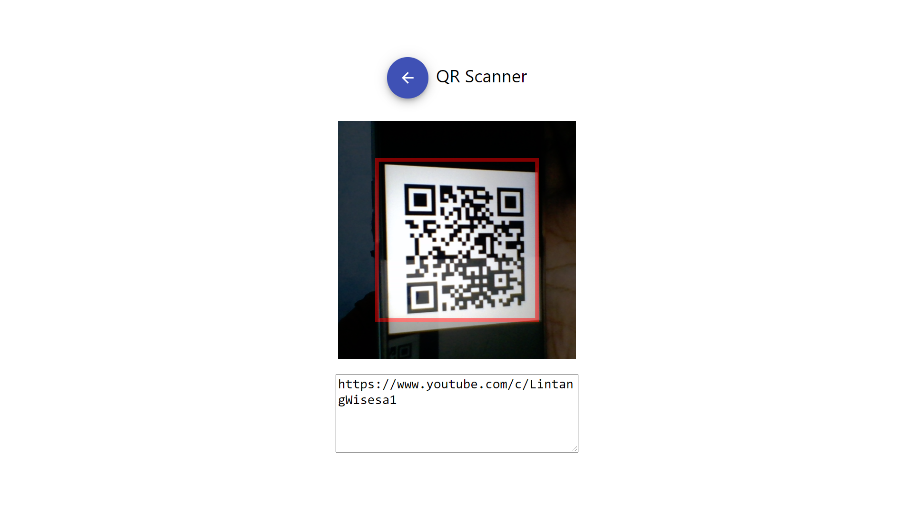

# React QR Code Scanner & Generator

A simple React application to generate & scan Quick Response code (QR code). 

- __Demo__:

  Click the following picture to see the demo video:

  [](https://youtu.be/vIXvBcrqKqg)
  
- __Clone this repo__:

  ```bash
  $ git clone https://github.com/LintangWisesa/React-QR-Scanner-Generator.git
  $ npm i
  $ npm start
  ```

- __React UI Kit: [Material UI](https://material-ui.com/)__

    Install Material UI core:
    ```bash
    $ npm i @material-ui/core @material-ui/icons
    ```

- __Icons: [Material Design Icons](https://materialdesignicons.com/)__

    Install Material Design Icons:
    ```bash
    $ npm i @mdi/react @mdi/js @mdi/font
    ```

    Add these lines on `./public/index.html` head:
    ```html
    <!-- Roboto fonts -->
    <link rel="stylesheet" href="https://fonts.googleapis.com/css?family=Roboto:300,400,500,700&display=swap" />
    <!-- Material Icons fonts -->
    <link rel="stylesheet" href="https://fonts.googleapis.com/icon?family=Material+Icons" />
    ```

- __QR Generator: [qrcode.react](https://www.npmjs.com/package/qrcode.react)__

    Install `qrcode.react`:
    ```bash
    $ npm i qrcode.react
    ```

- __QR Scanner: [react-qr-reader](https://www.npmjs.com/package/react-qr-reader)__

    Install `react-qr-reader`:
    ```bash
    $ npm i react-qr-reader
    ```

- __Preview__

  Home Page

  

  QR Generator Page
  
  

  QR Scanner Page
  
  

<hr>

#### 🍔 Lintang Wisesa

<br>

<a href="mailto: lintangwisesa@ymail.com">
  
</a>

<a href="https://web.facebook.com/lintangbagus/">
  
</a>

<a href="https://twitter.com/Lintang_Wisesa">
  
</a>

<a href="https://www.youtube.com/user/lintangbagus">
  
</a>

<a href="https://www.linkedin.com/in/lintangwisesa/">
  
</a>

<a href="https://github.com/LintangWisesa">
  
</a>

<a href="https://www.hackster.io/lintangwisesa">
  
</a>

<a href="https://lintangwisesa.github.io/me/">
  
</a>
